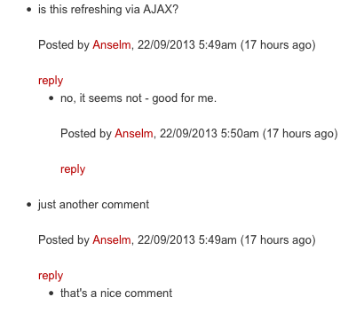

# Feature: Comment Threading

This is an experimental feature as per September 2013.

See [this ticket](https://github.com/silverstripe/silverstripe-comments/issues/28) for more info.

## Installation

Add the following lines to your `_config.php` (if this feature gets accepted, we'll find a better way of configuring this):

	Commenting::add('Comment');
	Commenting::set_config_value('Comment', 'experimental_commentthreading', true);
	Commenting::set_config_value('SiteTree', 'experimental_commentthreading', true);

## Screenshot

